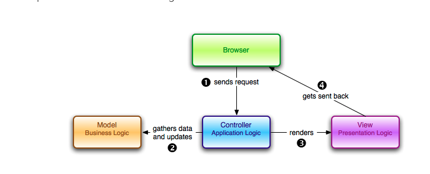

# RoR intro
Open source, used by Airbnb, Soundcloud, Disney, Hulu, Github, Gitlab, Shopify

RubyGames is a package manager for Ruby, was able to install Rails 6.0.1 through it. 
Default development web server used by Rails is called Puma. Can be accessed on port 3000.

Rails is based on 2 principles:
- DRY (don't repeat yourself): software development principle that states each piece of knowledge must have a single, unambiguous, authoritative representation within a system. Don't write the same stuff more than once.

- Convention Over Configuration: opinionated "best" way to do things according to Rails. There's no need to dive into minutiae of configuring files.

# Building blog app
## Architecture and concepts:
- In development mode, Rails does not generally require to restart the server; changes you make in files will be automatically picked up by the server. 

- Model is the layer between our application and the database.
- View is the presentation of data in a particular format, triggered by a controller's decision to present the data. Traditionally, views on the web will be an HTML styled with CSS and JS. 
- Controller lets you do all things with a model (or more than one model), i.e, CRUD operations on database, and also render a view to the client. The controller is the maestro, it takes care of the flow; uses the models to do queries, parse data, and makes decisions about which format you'll present your data.
- Router is used to map the URL path to the right controller. 

In summary, model handles business logic (saving and loading of data). The view renders the data in a specific format. The controller is the mediator between the two => Parses requests, does authentication/authorization, asks model for data, and calls appropriate view with that data.



Advanatage is threefold:
- Improved scalability: if the application starts to slow down because of database access, you can upgrade hardware running database without the other components being affected. 
- Ease of maintenance: low dependency on one another
- Reusability: a model can be reused by multiple views.

[Excellent article about this](https://www.sitepoint.com/model-view-controller-mvc-architecture-rails/)

ERB (e-Ruby) handler is designed to embed Ruby in HTML, which is the format of a standard view template. For other formats like JS or XML there are other handlers.

## Routing:
It can be found under config/routes.rb

`get 'welcome#index'` tells Rails to map requests to http://hostname/welcome/index to the welcome controller's index action. 
`root 'welcome#index'` tells Rails to map requests to the root of the application to the welcome controller's index action.

## Controller actions:
There are public, private, and protected methods in Ruby, but **only public methods can be actions for controllers**.

By default when controllers are generated in Rails they are empty by default, unless you tell it your desired actions during the generation process. 
To manually add an action inside a controller, simply go to that controller rb file and add a method with 
```
def new_method
end
```

**Unless told otherwise, Rails expects plain actions to have views associated with them (with the same name...as is the case with the index action of the Welcome controller and the associated index html view)**.

If no response is specified for an action, Rails by default returns `204 No Content`.

## Models (I)
Models in Rails use a singular name, and their corresponding database tables use a plural name.
```
rails generate model Article title:string text:text
```

is going to create an **Article** model, together with a *title* attribute of type string, and a *text* attribute of type text. Those attributes would be automatically added to the articles table in the database and are mapped to the Article model.

### Database migration
A database migration file created under `db/migrate` is basically a class that makes it simple to create and modify database tables. Migration filenames include a timestamp to ensure that they'er processed in the order that they were created.

### Review: SQLite vs ORDBMS like MySQL
- SQLite is serverless and is self-contained. This means the DB engine runs as part of the app.
MySQL and other ORDBMS require a server to run; they require a client and server architecture to interact over a network.
[SQLite vs MYSQL](https://www.hostinger.com/tutorials/sqlite-vs-mysql-whats-the-difference/)

## Models (II)
Every Rails model can be initialized with its respective attributes, which are automatically mapped to the respective database columns. 

Strong parameters are enabled by default => forbids ActionController parameters to be used in ActiveModel mass assignments until they have been permitted. This means that you'll have to make a conscious decision about which attributes to permit for mass update. This is a security measure to avoid assigning malicious contents in extra fields.

### Controller actions definition order
index, show, new, edit, create, update, and destroy.

## Linking pages
Page links can be achieved with `<%= link_to 'PAGE_NAME', controller: 'controller name' %>`

When you specify `articles_path` you're actually specifying the path of the articles prefix that appears when you run `rails routes`

**Note that if you want to link to an action in the same controller, you don't need to specify the `:controller` option, as Rails will use the current controller by default.**

**In development mode, Rails reloads your application with every browser request, so there's no need to stop and restart the web server when a change is made.**

## Validating data in models
`ApplicationRecord` inherits from `ActiveRecord::Base` which supplies a great deal of functionality to the Rails app for free, including data validation!

## Partials
Partial templates, aka, "partials", are another device for breaking the rendering process into more manageable chunks. With a partial, you can move the code for rendering a particular piece of a response to its own file. 
They are denoted with an underscore. E.g: `_menu.html.erb`

## HTTP basic authentication
This can be set at the controller level using `http_basic_authenticate_with name: "some_name", password: "some_password", except: [:____. :____]`

**NOTE: the colon operator before a variable a symbol -- equivalent to a static ENUM value in other languages; they are created once, and checking equality is a simple operation. The colon operator after a variable is an alternate for hashes. For example: foo: 1, bar: 2, means the symbol "key" will point to the symbol "value". Previously in Rails, the => operator was used instead, like :foo => :symbol. But new Rails has introduced syntactic sugar.**

[colon explanation](https://dev.to/aswathm78/explain-colon-and-colon-in-ruby-like-im-five-2646/comments)

## redirect_to
Another way to handle returning responses to an HTTP request is with `redirect_to`. As already established, `render` tells Rails which view (or other asset) to use in constructing a reponse. The `redirect_to` method does something completely different: it tells the browser to send a new request for a different URL. 
E.g. `redirect_to photos_url`

## Special tags in Rails
The `<%= %>` tag is used if you want to run the RUby code and insert the results to the HTML at that position.
The `<% %>` tag is used if you want to run the code between the delimiters and **not** insert the result in the HTML. This is useful for control flow structures (if statements or loops).

[Rails cheat sheet](http://www.pragtob.info/rails-beginner-cheatsheet/)